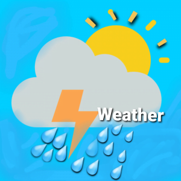

  
   

  <h3><b>React capstone project</b></h3>

<!-- TABLE OF CONTENTS -->

# 📗 Table of Contents

- [📖 About the Project](#about-project)
  - [🛠 Built With](#built-with)
    - [Tech Stack](#tech-stack)
    - [Key Features](#key-features)
  - [🚀 Live Demo](#live-demo)
- [💻 Getting Started](#getting-started)
  - [Prerequisites](#prerequisites)
  - [Setup](#setup)
  - [Install](#install)
  - [Usage](#usage)
  - [Run tests](#run-tests)
  - [Deployment](#deployment)
- [👥 Authors](#authors)
- [🔭 Future Features](#future-features)
- [🤝 Contributing](#contributing)
- [⭐️ Show your support](#support)
- [🙏 Acknowledgements](#acknowledgements)
- [❓ FAQ (OPTIONAL)](#faq)
- [📝 License](#license)

<!-- PROJECT DESCRIPTION -->

# 📖 [React capstone project] 

**[React capstone project]** This project is about building a mobile web application to check a list of metrics using React and Redux, in this case is with a weather data obtained since opeanweater API .

## 🛠 Built With 

### Tech Stack 

  
Technologies

  <ul>
    <li><a href="https://reactjs.org/">React</a></li>
    <li><a href="https://es.redux.js.org/">Redux</a></li>
  </ul>

Linters

  <ul>
    <li>Style Lint</li>
    <li>Es lint</li>
  </ul>

<!-- Features -->

### Key Features 

- **[Use of React/Redux]**
- **[Use of route to SPA]**
- **[Use of API to obtain data]**
- **[Responsive desing]**
- **[Use of redux toolkit]**

(<a href="#readme-top">back to top</a>)

<!-- LIVE DEMO -->

## 🚀 Live Demo 

- [Live Demo Link](https://google.com)

(<a href="#readme-top">back to top</a>)

<!-- GETTING STARTED -->

## 💻 Getting Started 

To get a local copy up and running, follow these steps.

### Prerequisites

You need a updated browser

### Setup

Clone this repository to your desired folder:

sh
cd my-folder
git clone https://github.com/Dachrono/capston_react.git

### Install

Install this project with:

npm install

### Usage

To run the project, execute the following command:

npm start

### Run tests

To run tests, run the following command:

npm test

<!-- ### Deployment

You can deploy this project using: -->

(<a href="#readme-top">back to top</a>)

<!-- AUTHORS -->

## 👥 Authors 

👤 **Andy Zam**

- GitHub: [Andres Zamorano](https://github.com/Dachrono)
- Twitter: [Andres Zamorano](https://twitter.com/Dachrono)
- LinkedIn: [Andres Zamorano](https://www.linkedin.com/in/andres-zamorano-785b77a1/)

(<a href="#readme-top">back to top</a>)

<!-- FUTURE FEATURES -->

## 🔭 Future Features 

- [1] **[Add more citys and countrys]**
- [2] **[Add pollution data for the citys]**

(<a href="#readme-top">back to top</a>)

## 🤝 Contributing 

Contributions, issues, and feature requests are welcome!

Feel free to check the [issues page](https://github.com/Dachrono/capston_react/issues).

(<a href="#readme-top">back to top</a>)

<!-- SUPPORT -->

## ⭐️ Show your support 

If you like this project please feel free to send me corrections for make it better I would feel glad to read your comments.
And think If you enjoy gift me a star.  

(<a href="#readme-top">back to top</a>)

<!-- ACKNOWLEDGEMENTS -->

## 🙏 Acknowledgments 

I’m not the original author of the design, it was taken from Nelson Sakwa on Behance, I take the fonts, color, and layout from his Ballhead App (Free PSDs). I want to thank him, so please go to his profile and support the original designer.

(<a href="#readme-top">back to top</a>)

## ❓ FAQ (OPTIONAL) 

- **[Can I use with a templeate your project?]**

  - [Of course I would feel honored]

- **[Your project is free license?]**

  - [Yeah, you can use it completly]

(<a href="#readme-top">back to top</a>)

<!-- LICENSE -->

## 📝 License 

this project is [MIT](./LICENSE.txt) licensed.

(<a href="#readme-top">back to top</a>)

